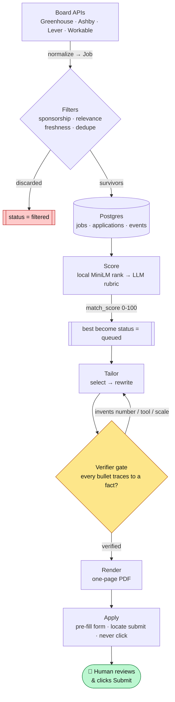

# JobAgent

[](https://github.com/Nanduu24/jobagent/actions/workflows/ci.yml)
[](https://github.com/astral-sh/ruff)
[](https://mypy-lang.org/)

[](LICENSE)
[](https://www.python.org/)

A personal, human-in-the-loop job-application pipeline. It discovers roles from
official ATS board APIs, scores how well each matches **your** background,
tailors a one-page resume from a **verified fact bank** (never fabricating a
claim), and pre-fills the application for you to review and submit yourself.

> **Not a mass-apply bot.** JobAgent prepares; a human decides and clicks Submit.
> It never auto-submits, never scrapes, and never invents a resume claim — these
> are enforced structurally, not by convention (see [Safety](#safety-guarantees)).

Bring your own data with `jobagent setup`, add your target companies, and run it.

<p align="center">
  
</p>

---

## Why

Job hunting at volume means re-tailoring a resume for every posting and copying
the same details into a dozen different forms. JobAgent automates the tedious,
mechanical parts — discovery, ranking, resume tailoring, form pre-fill — while
keeping a human in control of every claim made and every application sent.

## How it works



Each command drives one stage: `setup` builds your fact bank, `poll` ingests +
filters, `score` ranks and promotes strong matches to `queued`, and `run` tailors,
renders, and prepares each queued job for you — newest first — printing exactly
what to paste before **you** submit.

Every generated resume bullet must trace to a fact you entered, and is checked by
a verifier that drops anything introducing a number, tool, title, or scale not in
the source fact. Resumes are always exactly one page.

## What it produces

**The funnel.** Polling ~150 company boards ingests thousands of raw postings; the
filters throw out the overwhelming majority before a single LLM token is spent —
so scoring (the only paid stage) runs on a small, relevant shortlist:

```
 ~17,000  postings ingested        (Greenhouse · Ashby · Lever)
    ↓     sponsorship · relevance · freshness · dedupe
  ~1,500  survivors  →  scored     (≈ 91% filtered out, no LLM cost)
    ↓     MiniLM rank → LLM rubric on the top-N
    ~30   queued for tailoring     (match_score above threshold)
```

**Tailoring, kept honest.** The tailor only ever *selects, orders, and rephrases*
your verified facts. Given this fact from the [example fact bank](data/fact_bank.example.json):

> Developed an offline training and evaluation pipeline in PyTorch and
> scikit-learn that improved offline ranking AUC from 0.71 to 0.78 across three
> model iterations.

it may produce a tighter one-page bullet —

> ✅ Built a PyTorch/scikit-learn training & evaluation pipeline, lifting offline
> ranking AUC 0.71 → 0.78 over three model iterations.

— but the verifier **drops** any rewrite that smuggles in something the fact never
said (invented scale, tools, or metrics):

> ❌ …serving **2M+ users** in production  → *rejected: "2M+ users" and
> "production" appear in no source fact.*

Failing bullets are regenerated once, then dropped — never shipped.

## Quick start

### 1. Prerequisites

- **Python 3.11** and [**uv**](https://github.com/astral-sh/uv) (`pip install uv`)
- **Postgres 16** — via Docker, or Homebrew (helper included)
- An **LLM API key** — Gemini (easiest, generous free tier), Groq, or Anthropic

### 2. Install

```bash
git clone <your-fork-url> jobagent && cd jobagent
uv sync                        # create .venv and install dependencies
uv run playwright install chromium   # for the (optional) form pre-fill step
```

### 3. Configure

```bash
cp .env.example .env           # then edit: set your LLM API key
```

Open `.env` and set `LLM_PROVIDER` and the matching API key (e.g.
`GEMINI_API_KEY`). Everything else has a sensible default.

### 4. Start Postgres + create the schema

**With Docker:**

```bash
docker compose up -d db        # Postgres 16 on :5432 (matches the default URL)
uv run alembic upgrade head
```

**Without Docker (Homebrew helper):**

```bash
brew install postgresql@16
scripts/pg_local.sh start      # initdb + start on :5433 + create the db
# set DATABASE_URL to the :5433 form shown in .env.example, then:
uv run alembic upgrade head
scripts/pg_local.sh stop       # when you're done for the day
```

### 5. Build your fact bank

```bash
uv run jobagent setup          # interactive: profile, education, projects, facts
```

This writes `data/fact_bank.json` — your local, git-ignored source of truth.
Prefer editing JSON directly? Copy [`data/fact_bank.example.json`](data/fact_bank.example.json)
to `data/fact_bank.json` and fill it in. **The golden rule:** every `claim` must
be literally true — the tailor only ever selects, orders, and rephrases your
facts; it never adds anything you didn't state.

### 6. Pick your companies

Edit [`data/companies.yaml`](data/companies.yaml) — a curated, live-verified set
of ~150 AI/ML and software companies ships with the repo. Each entry is a board
`token`; add or remove freely.

### 7. Run the pipeline

```bash
uv run jobagent poll                 # discover + filter (a few minutes)
uv run jobagent score                # rank; promotes strong matches to 'queued'
uv run jobagent run --dry-run        # preview the candidate list it would build
uv run jobagent run                  # interactive apply loop (opens + prepares)
```

## Commands

| Command | What it does |
|---|---|
| `jobagent setup` | Interactively build your `fact_bank.json` (run first). |
| `jobagent poll` | Fetch postings from every board in `companies.yaml`, filter, upsert. |
| `jobagent score [--dry-run]` | Two-stage match scoring; `--dry-run` estimates cost with zero LLM calls. |
| `jobagent tailor --job <id> --out-dir renders` | Tailor + render a verified one-page resume for one job. |
| `jobagent run [--fresh] [--days N] [--dry-run]` | Interactive apply loop, newest-first. `--fresh` re-polls + re-scores first; `--days` sets the freshness window (default 30). |
| `jobagent init-db` | (dev) create tables without Alembic. |

In `jobagent run`, per job you type: **`next`** (I submitted this → mark applied),
**`skip`** (move on, stay queued), or **`stop`** (end with a summary). Applied
jobs are permanently de-duplicated from future runs.

## Board endpoints (public, unauthenticated)

| Board | Endpoint |
|---|---|
| Greenhouse | `GET https://boards-api.greenhouse.io/v1/boards/{token}/jobs?content=true` |
| Ashby | `GET https://api.ashbyhq.com/posting-api/job-board/{token}` |
| Lever | `GET https://api.lever.co/v0/postings/{token}?mode=json` |
| Workable | opt-in via `ENABLE_WORKABLE=true` (rate-limit-prone) |

Only official board APIs are used — **never** LinkedIn/Indeed scraping.

## Safety guarantees

These are the project's non-negotiable constraints, enforced in code and tests:

1. **Never auto-submits.** The apply layer has *no* submit/click method by
   construction; it locates the submit button and stops. `run` opens and
   prepares — you submit.
2. **Never scrapes.** Discovery uses official ATS board APIs only.
3. **Never fabricates a resume claim.** Every bullet must trace to a fact id and
   pass a verifier that rejects invented numbers, tools, titles, or scale;
   failing bullets are regenerated once, then dropped — never shipped.
4. **Always one page.** If a rendered resume spills onto a second page, the
   lowest-relevance bullet is dropped and it re-renders until it fits.
5. **Answers only honest, factual form fields.** Anything sensitive or
   subjective — EEO/demographics, citizenship beyond a factual work-auth line,
   salary, "why us" free-text — is always flagged for you, never guessed.
6. **Your data stays local.** `data/fact_bank.json` and `.env` are git-ignored.

## Configuration

All knobs live in [`.env.example`](.env.example) with inline docs — cost guards,
score threshold, scoring window, tailoring caps, and the freshness window. Copy
it to `.env` and adjust.

## Architecture

```
jobagent/
  ingest/      one adapter per board API, normalized → Job
  filters/     sponsorship, relevance, freshness, near-dup dedupe
  scoring/     local MiniLM embedding rank + LLM rubric → match_score
  tailor/      select → rewrite → verify → render (one-page PDF)
  apply/       Playwright form pre-fill (locate submit, never click)
  onboarding/  interactive fact-bank builder (jobagent setup)
  runner       interactive apply loop (jobagent run)
  db/          SQLAlchemy models + Alembic migrations
  llm/         provider abstraction (Gemini / Groq / Anthropic)
data/
  fact_bank.example.json   copy → your git-ignored fact_bank.json
  companies.yaml           board tokens to poll
```

**Stack:** Python 3.11 · SQLAlchemy 2.0 (async) + Postgres 16 · sentence-transformers
(local embeddings) · WeasyPrint (PDF) · Playwright (headed pre-fill) · Typer (CLI).

## Data model

- **jobs** — canonical normalized posting; PK `"{source}:{job_id}"`.
- **applications** — one row per application attempt.
- **events** — append-only, one row per status change (a timeline).

Status lifecycle: `new → filtered | queued → applied → rejected | interview → offer`.

## Development

```bash
uv run ruff check jobagent tests   # lint
uv run mypy                        # strict type-checking on jobagent/
uv run pytest -q --cov=jobagent    # full suite + coverage
```

All three run in CI on every push and pull request. The test suite uses a
fictional fixture fact bank (`tests/fixtures/fact_bank.json`) — 244 tests,
respx-mocked adapters and a scripted LLM, so it never makes a real network or
LLM call.

## Scope & disclaimer

JobAgent is a personal productivity tool and portfolio project. "match_score" is a
keyword/embedding heuristic, **not** a real ATS verdict. You are responsible for
the accuracy of your fact bank and for every application you submit. Respect each
board's terms of service.

## License

[MIT](LICENSE).
